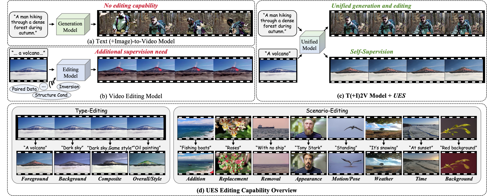

<!-- <p align="center">
    
<p> -->
<h2 align="center"> <a href="https://arxiv.org/abs/2311.10122">Beyond Generation: Unlocking Universal Editing via Self-Supervised Fine-Tuning</a></h2>
<!-- {: width="50%"} -->
<!--  -->
<div align="center">
<!-- </img> -->


_**[Harold Haodong Chen](https://haroldchen19.github.io/)<sup>1,2</sup>, [Harry Yang](https://leehomyc.github.io/)<sup>1,2</sup>, [Ser-Nam Lim](https://sites.google.com/site/sernam)<sup>2,3</sup>**_
<br><br>
<sup>1</sup>HKUST, <sup>2</sup>Everlyn AI, <sup>3</sup>UCF

<h5 align="center"> If you like our project, please give us a star ⭐ on GitHub for latest update.  </h2>

 <a href='https://arxiv.org/abs/2412.02114'></a> &nbsp;
 <a href='https://haroldchen19.github.io/UES-Page/'></a> &nbsp;
<a href='https://huggingface.co/datasets/Harold328/OmniBench-99'></a>&nbsp;

</div>

<table class="center">
    <tr>
    <td></td>
    </tr>
</table>
 
## 🔥 Update
- __[2025.04.02]__: Released the training & inference code of UES on [DynamiCrafter](https://github.com/Doubiiu/DynamiCrafter).
- __[2025.03.18]__: Initialized this github repository and released UES [Paper](https://arxiv.org/abs/2412.02114).


## 🧰 TODO

- [ ] Release UES model weights.
- [ ] Release code of UES on [VideoCrafter2](https://github.com/AILab-CVC/VideoCrafter).
- [ ] Release code of UES on [CogVideoX-5B](https://github.com/THUDM/CogVideo).
- [ ] Release code of UES on [HunyuanVideo](https://github.com/Tencent/HunyuanVideo).

<!-- ## 🧰 Models

|Model|Resolution|GPU Mem. & Inference Time (A100, ddim 50steps)|Checkpoint|
|:---------|:---------|:--------|:--------|
|DynamiCrafter1024|576x1024|18.3GB & 75s (`perframe_ae=True`)|[Hugging Face](https://huggingface.co/Doubiiu/DynamiCrafter_1024/blob/main/model.ckpt)|

Currently, our DynamiCrafter can support generating videos of up to 16 frames with a resolution of 576x1024. The inference time can be reduced by using fewer DDIM steps.

GPU memory consumed on RTX 4090 reported by @noguchis in [Twitter](https://x.com/noguchis/status/1754488826016432341?s=20): 18.3GB (576x1024), 12.8GB (320x512), 11.9GB (256x256). -->

## 🎬 UES on DynamiCrafter

### Setup

```bash
conda create -n UESDC python=3.8.5
conda activate UESDC
pip install -r requirements.txt
```


### 🎥 Inference
#### Text-to-Video Generation
1) Download pretrained models via Hugging Face, and put the `UES_DC_512x320.ckpt` with the required resolution in `.checkpoints/UES_DC_512x320.ckpt`.
2) Run the commands based on your devices and needs in terminal.
```bash
  sh scripts/run_gen.sh
```

#### Text-guided Video Editing
Run the commands based on your devices and needs in terminal.
```bash
  sh scripts/run_edit.sh
```

### 🎥 Training / Fine-tuning
1. Please following [DynamiCrafter](https://github.com/Doubiiu/DynamiCrafter) to set the data root.
2. Download the pretrained models and put them in the corresponding directory according to the previous guidelines.
3. Change `<YOUR_SAVE_ROOT_DIR>` path in `training_v1.0/run.sh`
4. Carefully check all paths in `training_v1.0/config.yaml`, including `model:pretrained_checkpoint`, `data:data_dir`, and `data:meta_path`.
5. Input the following commands in terminal.

We adopt `DDPShardedStrategy` by default for training, please make sure it is available in your pytorch_lightning.
```bash
  sh configs/training_v1.0/run.sh 
```
6. All the checkpoints/tensorboard record/loginfo will be saved in `<YOUR_SAVE_ROOT_DIR>`.


## 🎏 OmniBench-99
The evaluation videos and annoations of our OmniBench-99 is available on [Huggingface](https://huggingface.co/datasets/Doubiiu/webvid10m_motion). Please refer to our [Paper](https://arxiv.org/abs/2412.02114) for more details.


## 🎬 UES on VideoCrafter2
## 🎬 UES on CogVideoX
## 🎬 UES on HunyuanVideo


## 📝 Citation
Please consider citing our paper if our code and benchmark are useful:
```bib
@article{chen2024omnicreator,
    title={OmniCreator: Self-Supervised Unified Generation with Universal Editing},
    author={Chen, Haodong and Wang, Lan and Yang, Harry and Lim, Ser-Nam},
    journal={arXiv preprint arXiv:2412.02114},
    year={2024}
}
```

## 🍗 Acknowledgements
Our codebase builds on [DynamiCrafter](https://github.com/Doubiiu/DynamiCrafter), [VideoCrafter2](https://github.com/AILab-CVC/VideoCrafter), [CogVideoX-5B](https://github.com/THUDM/CogVideo), and [HunyuanVideo](https://github.com/Tencent/HunyuanVideo). Thanks the authors for sharing their awesome codebase!

## 📌 Disclaimer
We develop this repository for RESEARCH purposes, so it can only be used for personal/research/non-commercial purposes.
****
